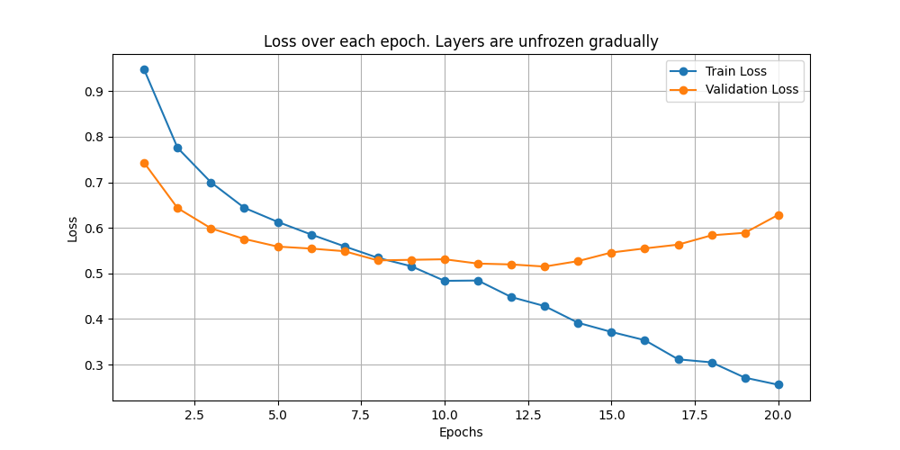
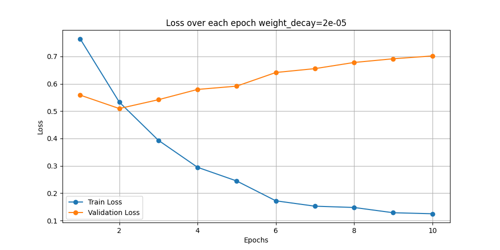
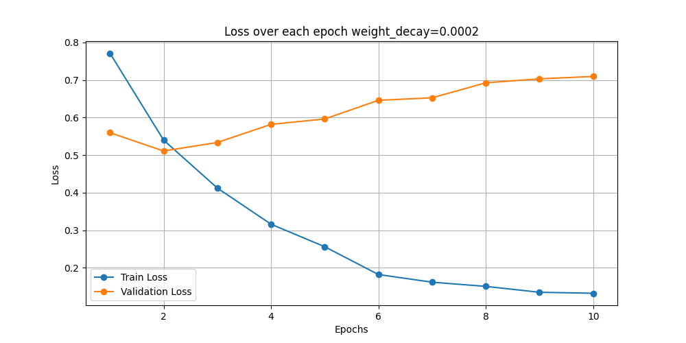
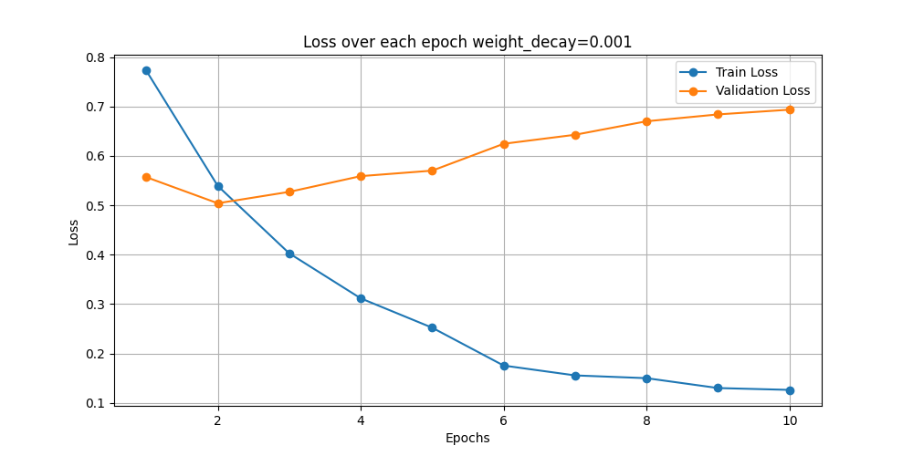
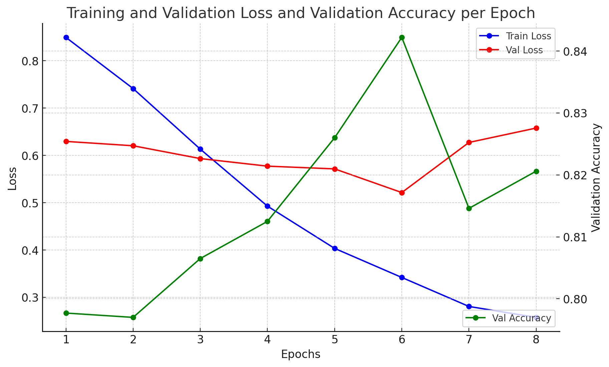
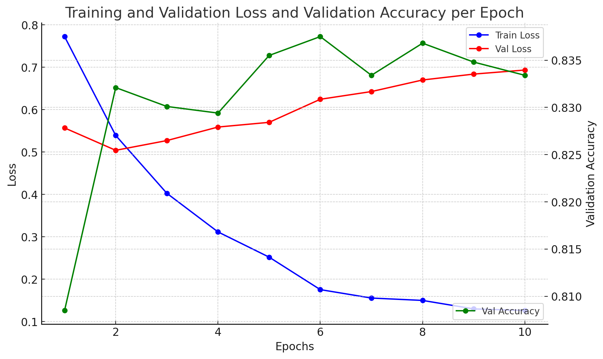

# Introduction
Text classification is a complex task. Given the small dataset, I decided to augment a pretrained model to improve performance. I experimented with various augmentation approaches to determine which are most effective. I selected BERT, known for its strong text comprehension capabilities.

The following experiments involve simple augmentation techniques, chosen to test the effectiveness of straightforward methods. These included freezing/unfreezing layers, using different optimizers, applying early stopping (both manual and automatic to avoid overfitting), and utilizing a larger BERT model. Despite their simplicity, these approaches achieved reasonable results.

# Methodology
Each experiment begins with a hypothesis and uses specified methods to achieve optimal results. I document my thoughts throughout the process and include tables and graphs to show results for each sub-experiment.
A sub-directory in the repository, titled "Experiments," contains the code for replicating the final stages of the experiment.

# Baseline
**This model serves as the baseline, which I will modify in various ways to optimize results.**

First, I extract the necessary fields ("text" and "label") from the JSON data, tokenize it with the BERT tokenizer, and encode the targets numerically. This tokenized data is then fed into a baseline model built on the "bert-base-uncased" pretrained BERT, followed by a classifier layer to perform classification.

The model is trained using PyTorch’s Adam optimizer, which minimizes CrossEntropyLoss. Due to limited VRAM, I use a small batch size of 16. The data is split into 80% training and 20% validation sets, following the initial training/test split from the task. I also apply an attention mask and track training/validation loss and validation accuracy over epochs.

In this baseline model, I haven’t implemented schedulers, patience counters, or other techniques, as these are the focus of later experiments. After a few minutes of adjusting, I determined that a learning rate of 2e-5 works well as a baseline for this task.

# Experiment 1
**Hypothesis:** Stopping the model early will prevent overfitting.

The baseline model didn’t specify a set number of epochs since this varies with different augmentations. I initially set the epoch limit to 15. While training loss continued to decrease, this wasn’t a reliable indicator of model performance. Instead, the validation loss and accuracy began plateauing around epoch 3, highlighting overfitting. Although the CrossEntropyLoss of the validation set converged by epoch 3, I ran all 15 epochs.

### Results:
**Test Accuracy (Epoch 15):** 0.7830

|              | precision | recall | f1-score | support |
|--------------|-----------|--------|----------|---------|
| **answer**   | 0.80      | 0.81   | 0.80     | 821     |
| **header**   | 0.42      | 0.39   | 0.41     | 122     |
| **other**    | 0.61      | 0.54   | 0.57     | 312     |
| **question** | 0.85      | 0.88   | 0.87     | 1077    |
| **accuracy** |           |        | 0.78     | 2332    |
| **macro avg**| 0.67      | 0.66   | 0.66     | 2332    |
| **weighted avg** | 0.78   | 0.78   | 0.78     | 2332    |

Due to poor results, I introduced early stopping and ran the model again, ending training at epoch 3. This adjustment yielded significantly improved performance.

**Test Accuracy (Epoch 3):** 0.8109

|              | precision | recall | f1-score | support |
|--------------|-----------|--------|----------|---------|
| **answer**   | 0.85      | 0.82   | 0.83     | 821     |
| **header**   | 0.51      | 0.34   | 0.40     | 122     |
| **other**    | 0.61      | 0.61   | 0.61     | 312     |
| **question** | 0.86      | 0.92   | 0.89     | 1077    |
| **accuracy** |           |        | 0.81     | 2332    |
| **macro avg**| 0.71      | 0.67   | 0.68     | 2332    |
| **weighted avg** | 0.80   | 0.81   | 0.81     | 2332    |

### Conclusion:
Early stopping significantly improved model performance by reducing overfitting, as evidenced by the increase in accuracy and F1 scores.

# Experiment 2
**Hypothesis:** Freezing layers will allow longer training without overfitting, leading to better performance.

In this experiment, I froze certain layers to observe its impact on model performance. I initially set the epoch count to 10 to identify when the model began to overfit. I found that overfitting started around the sixth epoch.

To account for this, I reduced the epoch count to 5. Here are the results:

### Results with 4 Unfrozen Layers:
**Test Accuracy:** 0.7929

|              | precision | recall | f1-score | support |
|--------------|-----------|--------|----------|---------|
| **answer**   | 0.82      | 0.82   | 0.82     | 821     |
| **header**   | 0.51      | 0.30   | 0.38     | 122     |
| **other**    | 0.56      | 0.52   | 0.54     | 312     |
| **question** | 0.85      | 0.91   | 0.88     | 1077    |
| **accuracy** |           |        | 0.79     | 2332    |
| **macro avg**| 0.69      | 0.64   | 0.65     | 2332    |
| **weighted avg** | 0.78   | 0.79   | 0.79     | 2332    |

The results showed a decline in performance, prompting me to test different configurations for frozen layers. 

### Results with 2 Unfrozen Layers:
I found that the model began to overfit around the eighth epoch, so I stopped training at the seventh.

**Test Accuracy:** 0.8053

| 2 Unfrozen Layers | precision | recall | f1-score | support |
|------------------|-----------|--------|----------|---------|
| **answer**       | 0.86      | 0.82   | 0.84     | 821     |
| **header**       | 0.52      | 0.32   | 0.40     | 122     |
| **other**        | 0.60      | 0.63   | 0.61     | 312     |
| **question**     | 0.84      | 0.89   | 0.87     | 1077    |
| **accuracy**     |           |        | 0.80     | 2332    |
| **macro avg**    | 0.67      | 0.67   | 0.68     | 2332    |
| **weighted avg** | 0.80      | 0.80   | 0.80     | 2332    |

### Results with 8 Unfrozen Layers:
The best validation accuracy was observed around the fourth epoch, so I stopped training there.

**Test Accuracy:** 0.8057

| 8 Unfrozen Layers | precision | recall | f1-score | support |
|-------------------|-----------|--------|----------|---------|
| **answer**        | 0.79      | 0.87   | 0.83     | 821     |
| **header**        | 0.45      | 0.35   | 0.40     | 122     |
| **other**         | 0.70      | 0.45   | 0.55     | 312     |
| **question**      | 0.86      | 0.91   | 0.89     | 1077    |
| **accuracy**      |           |        | 0.81     | 2332    |
| **macro avg**     | 0.70      | 0.65   | 0.67     | 2332    |
| **weighted avg**  | 0.80      | 0.81   | 0.80     | 2332    |

### Conclusion:
The results indicate that freezing fewer layers can improve model performance, as shown by the increased accuracy with 2 unfrozen layers. Further experimentation with layer configurations may lead to even better results.

# Experiment 2.1
**Unfreezing Gradually**

In this step, I gradually unfreezed the layers of the model while implementing a patience counter of 2. This counter allowed the model to unfreeze additional layers as the validation accuracy converged.

The model began to overfit around the thirteenth epoch. After manual adjustments, I decreased the learning rate to 1.6e-5, increased the patience to 3, and extended the epoch count to 16. The results were as follows:

### Results:
*Test Accuracy:* 0.8070

|              | precision | recall | f1-score | support |
|--------------|-----------|--------|----------|---------|
| **answer**   | 0.81      | 0.86   | 0.83     | 821     |
| **header**   | 0.50      | 0.41   | 0.45     | 122     |
| **other**    | 0.66      | 0.60   | 0.63     | 312     |
| **question** | 0.87      | 0.88   | 0.87     | 1077    |
| **accuracy** |           |        | 0.81     | 2332    |
| **macro avg**| 0.71      | 0.68   | 0.70     | 2332    |
| **weighted avg** | 0.80   | 0.81   | 0.80     | 2332    |

### Conclusion:
These results were the best I could achieve using this method, but they were not an improvement over simply stopping the baseline model early. Thus, gradual unfreezing did not lead to enhanced performance.

# Experiment 3
**Hypothesis:** Adding weight decay and early stopping will help avoid overfitting.

In this experiment, I implemented weight decay (L2 regularization) in the optimizer to see if it could improve the results. Additionally, I introduced automatic early stopping, which halts training if there is no improvement in validation accuracy for 2 consecutive epochs. I started with a weight decay of 2e-4, while also testing values of 2e-5 and 1e-3 to assess their impacts.

### Weight Decay of 2e-5

**Test Accuracy:** 0.7972

|      2e-5    | precision | recall | f1-score | support |
|--------------|-----------|--------|----------|---------|
| **answer**   | 0.86      | 0.82   | 0.84     | 821     |
| **header**   | 0.39      | 0.45   | 0.42     | 122     |
| **other**    | 0.57      | 0.64   | 0.61     | 312     |
| **question** | 0.88      | 0.87   | 0.87     | 1077    |
| **accuracy** |           |        | 0.80     | 2332    |
| **macro avg**| 0.67      | 0.69   | 0.68     | 2332    |
| **weighted avg** | 0.81   | 0.80   | 0.80     | 2332    |

### Weight Decay of 2e-4

**Test Accuracy:** 0.7963

|              | precision | recall | f1-score | support |
|--------------|-----------|--------|----------|---------|
| **answer**   | 0.77      | 0.89   | 0.83     | 821     |
| **header**   | 0.44      | 0.33   | 0.38     | 122     |
| **other**    | 0.64      | 0.46   | 0.54     | 312     |
| **question** | 0.88      | 0.87   | 0.88     | 1077    |
| **accuracy** |           |        | 0.80     | 2332    |
| **macro avg**| 0.68      | 0.64   | 0.65     | 2332    |
| **weighted avg** | 0.79   | 0.80   | 0.79     | 2332    |

### Weight Decay of 1e-3

**Test Accuracy:** 0.7950

|     1e-3     | precision | recall | f1-score | support |
|--------------|-----------|--------|----------|---------|
| **answer**   | 0.75      | 0.93   | 0.83     | 821     |
| **header**   | 0.51      | 0.29   | 0.37     | 122     |
| **other**    | 0.60      | 0.45   | 0.51     | 312     |
| **question** | 0.90      | 0.85   | 0.88     | 1077    |
| **accuracy** |           |        | 0.80     | 2332    |
| **macro avg**| 0.69      | 0.63   | 0.65     | 2332    |
| **weighted avg** | 0.79   | 0.80   | 0.78     | 2332    |

### Conclusion:
The implementation of weight decay and early stopping did not significantly improve the model's ability to avoid overfitting on its own.

# Experiment 3.1

**Hypothesis:** Stopping the model later, while using L2 regularization, can lead to slightly better performance.

During the analysis of previous results, I observed slight improvements in test scores when allowing the model to run longer, despite increasing loss. This side experiment aims to replicate those findings by adjusting the patience parameter in early stopping from 2 to higher values (4, 6, and 8).

### Results

#### Patience = 4

**Test Accuracy:** 0.8057

|  epoch 6  | precision | recall | f1-score | support |
|-----------|-----------|--------|----------|---------|
| **answer**| 0.86      | 0.83   | 0.84     | 821     |
| **header**| 0.41      | 0.46   | 0.43     | 122     |
| **other** | 0.58      | 0.67   | 0.62     | 312     |
| **question**| 0.89    | 0.87   | 0.88     | 1077    |
| **accuracy**|         |        | 0.81     | 2332    |
| **macro avg**| 0.69   | 0.71   | 0.69     | 2332    |
| **weighted avg**| 0.81| 0.81   | 0.81     | 2332    |

#### Patience = 6
**Test Accuracy:** 0.8057

|  epoch 8  | precision | recall | f1-score | support |
|-----------|-----------|--------|----------|---------|
| **answer**| 0.86      | 0.83   | 0.84     | 821     |
| **header**| 0.41      | 0.34   | 0.37     | 122     |
| **other** | 0.59      | 0.64   | 0.62     | 312     |
| **question**| 0.87    | 0.89   | 0.88     | 1077    |
| **accuracy**|         |        | 0.81     | 2332    |
| **macro avg**| 0.68   | 0.68   | 0.68     | 2332    |
| **weighted avg**| 0.81| 0.81   | 0.81     | 2332    |

#### Patience = 5
**Test Accuracy:** 0.7962

|  epoch 7  | precision | recall | f1-score | support |
|-----------|-----------|--------|----------|---------|
| **answer**| 0.83      | 0.85   | 0.84     | 821     |
| **header**| 0.40      | 0.40   | 0.40     | 122     |
| **other** | 0.55      | 0.65   | 0.59     | 312     |
| **question**| 0.90    | 0.83   | 0.86     | 1077    |
| **accuracy**|         |        | 0.79     | 2332    |
| **macro avg**| 0.67   | 0.68   | 0.67     | 2332    |
| **weighted avg**| 0.80| 0.79   | 0.79     | 2332    |

#### Patience = 8
**Test Accuracy:** 0.8027

|  epoch 10 | precision | recall | f1-score | support |
|-----------|-----------|--------|----------|---------|
| **answer**| 0.85      | 0.83   | 0.84     | 821     |
| **header**| 0.38      | 0.37   | 0.38     | 122     |
| **other** | 0.59      | 0.65   | 0.62     | 312     |
| **question**| 0.88    | 0.88   | 0.88     | 1077    |
| **accuracy**|         |        | 0.80     | 2332    |
| **macro avg**| 0.68   | 0.68   | 0.68     | 2332    |
| **weighted avg**| 0.81| 0.80   | 0.80     | 2332    |

### Conclusion
Increasing the patience parameter while applying weight decay can lead to improved model performance, as evidenced by the slight increase in test accuracy.

# Experiment 4

**Hypothesis:** Increasing the batch size will lead to better general performance, though it may increase training time and the risk of overfitting.

Despite earlier limitations regarding VRAM, I attempted to increase the batch size for this experiment. 

### Baseline Test
With only the batch size changed, the baseline results were:

**Test Accuracy:** 0.7895

|              | precision | recall | f1-score | support |
|--------------|-----------|--------|----------|---------|
| **answer**   | 0.76      | 0.89   | 0.82     | 821     |
| **header**   | 0.42      | 0.43   | 0.42     | 122     |
| **other**    | 0.62      | 0.42   | 0.50     | 312     |
| **question** | 0.90      | 0.86   | 0.88     | 1077    |
| **accuracy** |           |        | 0.79     | 2332    |
| **macro avg**| 0.67      | 0.65   | 0.66     | 2332    |
| **weighted avg** | 0.79  | 0.79   | 0.78     | 2332    |

The baseline test indicated that performance was not satisfactory. To address this, I decided to implement L2 regularization to help combat potential overfitting. 

### Regularization Test
I started with an aggressive weight decay of 1e-3 and a patience of 4, which had previously yielded good results. The results were as follows:

**Test Accuracy:** 0.8040

|              | precision | recall | f1-score | support |
|--------------|-----------|--------|----------|---------|
| **answer**   | 0.87      | 0.83   | 0.85     | 821     |
| **header**   | 0.37      | 0.48   | 0.42     | 122     |
| **other**    | 0.59      | 0.65   | 0.62     | 312     |
| **question** | 0.89      | 0.87   | 0.88     | 1077    |
| **accuracy** |           |        | 0.80     | 2332    |
| **macro avg**| 0.68      | 0.71   | 0.69     | 2332    |
| **weighted avg** | 0.82  | 0.80   | 0.81     | 2332    |

### Observations
Notably, there was a significant class imbalance, which could have influenced the results. To enhance the dataset and address this issue, I researched data augmentation techniques. One method I found effective was translating the text to another language and back to augment the data.

### Conclusion
Given the challenges observed with class imbalance, I decided to cut this experiment short and focus on augmenting the data for future tests. I will use the augmented dataset moving forward.

# Experiment 5

**Hypothesis:** Augmenting the data to balance the different classes will improve overall performance across the classes.

### Challenges Encountered
During this experiment, I encountered a significant issue. Balancing the classes with the augmented dataset led to dramatically increased training times—what previously took about 2 minutes now exceeded 20 minutes. This escalation in training duration significantly reduced the number of experiments I could conduct. As a result, I decided to limit my trials with this dataset and postpone its use until I worked on the final model.

Due to the lengthy training times, I did not produce any graphs for the models that utilized the augmented dataset. However, I did explore different batch sizes.

### Results with Augmented Data

#### Batch Size = 8
**Test Accuracy:** 0.7757

|              | precision | recall | f1-score | support |
|--------------|-----------|--------|----------|---------|
| **answer**   | 0.80      | 0.81   | 0.81     | 821     |
| **header**   | 0.40      | 0.52   | 0.45     | 122     |
| **other**    | 0.55      | 0.56   | 0.56     | 312     |
| **question** | 0.88      | 0.84   | 0.86     | 1077    |
| **accuracy** |           |        | 0.78     | 2332    |
| **macro avg**| 0.66      | 0.68   | 0.67     | 2332    |
| **weighted avg** | 0.79  | 0.78   | 0.78     | 2332    |

#### Batch Size = 16
**Test Accuracy:** 0.7780

|              | precision | recall | f1-score | support |
|--------------|-----------|--------|----------|---------|
| **answer**   | 0.79      | 0.83   | 0.81     | 821     |
| **header**   | 0.44      | 0.48   | 0.46     | 122     |
| **other**    | 0.55      | 0.55   | 0.55     | 312     |
| **question** | 0.88      | 0.84   | 0.86     | 1077    |
| **accuracy** |           |        | 0.78     | 2332    |
| **macro avg**| 0.67      | 0.68   | 0.67     | 2332    |
| **weighted avg** | 0.78  | 0.78   | 0.78     | 2332    |

### Observations
The best results were observed with a batch size of 16. While I noted a slight improvement in the F1 score for the lesser-represented class, "header," the overall test accuracy did not significantly increase. 

Due to the excessive training time associated with the augmented dataset, I decided to revert to the original dataset for future experiments.

### Conclusion
Although I observed a slight improvement in the F1 score of the underrepresented "header" class, the extended training times necessitated a reduction in the number of experiments conducted. Therefore, the results remain inconclusive, and I will transition back to using the original dataset moving forward.

# Experiment 6

**Hypothesis:** Using a larger pretrained model, I might get a more nuanced classification of the data.

### Experiment Overview
In this experiment, I swapped the `bert-base-uncased` model with the larger `bert-large-uncased` model and maintained the baseline configuration, adding early stopping. Initially, I set a batch size of 16, and the model was trained until early stopping was triggered at epoch 7.

#### Batch Size = 16
**Test Accuracy:** 0.8053

|              | precision | recall | f1-score | support |
|--------------|-----------|--------|----------|---------|
| **answer**   | 0.81      | 0.85   | 0.83     | 821     |
| **header**   | 0.47      | 0.45   | 0.46     | 122     |
| **other**    | 0.65      | 0.54   | 0.59     | 312     |
| **question** | 0.88      | 0.89   | 0.88     | 1077    |
| **accuracy** |           |        | 0.81     | 2332    |
| **macro avg**| 0.70      | 0.68   | 0.69     | 2332    |
| **weighted avg** | 0.80  | 0.81   | 0.80     | 2332    |

I also mistakenly ran the model with a batch size of 32, which yielded similar but slightly better performance:

#### Batch Size = 32
**Test Accuracy:** 0.8079

|              | precision | recall | f1-score | support |
|--------------|-----------|--------|----------|---------|
| **answer**   | 0.86      | 0.82   | 0.84     | 821     |
| **header**   | 0.44      | 0.41   | 0.43     | 122     |
| **other**    | 0.64      | 0.68   | 0.66     | 312     |
| **question** | 0.86      | 0.88   | 0.87     | 1077    |
| **accuracy** |           |        | 0.81     | 2332    |
| **macro avg**| 0.70      | 0.70   | 0.70     | 2332    |
| **weighted avg** | 0.81  | 0.81   | 0.81     | 2332    |

### Additional Experiment with Weight Decay
Next, I applied a weight decay of `1e-3` to mitigate overfitting, using a batch size of 16. While the model converged slowly, performance dropped significantly after early stopping was triggered at epoch 9. 

#### Weight Decay = 1e-3, Batch Size = 16
**Test Accuracy:** 0.7702

|              | precision | recall | f1-score | support |
|--------------|-----------|--------|----------|---------|
| **answer**   | 0.77      | 0.83   | 0.80     | 821     |
| **header**   | 0.38      | 0.45   | 0.42     | 122     |
| **other**    | 0.54      | 0.51   | 0.53     | 312     |
| **question** | 0.89      | 0.84   | 0.86     | 1077    |
| **accuracy** |           |        | 0.77     | 2332    |
| **macro avg**| 0.65      | 0.66   | 0.65     | 2332    |
| **weighted avg** | 0.77  | 0.77   | 0.77     | 2332    |

I then reduced the patience level to 2, which yielded slightly better results:

#### Reduced Patience = 2, Weight Decay = 1e-3, Batch Size = 16
**Test Accuracy:** 0.7877

|              | precision | recall | f1-score | support |
|--------------|-----------|--------|----------|---------|
| **answer**   | 0.76      | 0.87   | 0.81     | 821     |
| **header**   | 0.45      | 0.35   | 0.39     | 122     |
| **other**    | 0.67      | 0.46   | 0.55     | 312     |
| **question** | 0.87      | 0.87   | 0.87     | 1077    |
| **accuracy** |           |        | 0.79     | 2332    |
| **macro avg**| 0.68      | 0.64   | 0.66     | 2332    |
| **weighted avg** | 0.78  | 0.79   | 0.78     | 2332    |

Finally, I lowered the weight decay to `2e-4`, which yielded the best results:

#### Weight Decay = 2e-4, Batch Size = 16
**Test Accuracy:** 0.8092

|              | precision | recall | f1-score | support |
|--------------|-----------|--------|----------|---------|
| **answer**   | 0.84      | 0.85   | 0.85     | 821     |
| **header**   | 0.42      | 0.53   | 0.47     | 122     |
| **other**    | 0.64      | 0.61   | 0.62     | 312     |
| **question** | 0.89      | 0.87   | 0.88     | 1077    |
| **accuracy** |           |        | 0.81     | 2332    |
| **macro avg**| 0.70      | 0.71   | 0.70     | 2332    |
| **weighted avg** | 0.81  | 0.81   | 0.81     | 2332    |

I then repeated this with a batch size of 32, but the results declined. The model began performing well until after epoch 6, where validation accuracy plummeted, and validation loss sharply increased.

#### Weight Decay = 2e-4, Batch Size = 32
**Test Accuracy:** 0.7895

|              | precision | recall | f1-score | support |
|--------------|-----------|--------|----------|---------|
| **answer**   | 0.89      | 0.78   | 0.83     | 821     |
| **header**   | 0.33      | 0.45   | 0.38     | 122     |
| **other**    | 0.58      | 0.70   | 0.64     | 312     |
| **question** | 0.87      | 0.86   | 0.86     | 1077    |
| **accuracy** |           |        | 0.79     | 2332    |
| **macro avg**| 0.67      | 0.70   | 0.68     | 2332    |
| **weighted avg** | 0.81  | 0.79   | 0.80     | 2332    |

### Observations
The larger model demonstrated potential for better performance with the correct settings, notably with `2e-4` weight decay. Training times increased significantly, however, so I will use the larger model only in the final experiment.

### Conclusion
This experiment was fruitful, showing that the larger model can improve performance with careful tuning. However, the substantial increase in training time requires further consideration, so for the remaining experiments, I will selectively apply this model.

# Experiment 7

**Hypothesis:** Adding a class weight will help the model achieve more consistent performance across classes.

### Experiment Overview
For this experiment, I reverted to the base `bert-base-uncased` model to modify a single variable at a time. I used `sklearn.utils.class_weight`'s `compute_class_weight` function to calculate class weights and apply them to the loss function. During a trial run, I noticed that the validation loss spiked after initially converging. As a result, I reduced the patience from 4 to 2 before proceeding with further experimentation.

#### Batch Size = 16
**Test Accuracy:** 0.7706

|              | precision | recall | f1-score | support |
|--------------|-----------|--------|----------|---------|
| **answer**   | 0.87      | 0.74   | 0.80     | 821     |
| **header**   | 0.34      | 0.44   | 0.39     | 122     |
| **other**    | 0.50      | 0.72   | 0.59     | 312     |
| **question** | 0.88      | 0.85   | 0.86     | 1077    |
| **accuracy** |           |        | 0.77     | 2332    |
| **macro avg**| 0.65      | 0.69   | 0.66     | 2332    |
| **weighted avg** | 0.80  | 0.77   | 0.78     | 2332    |

#### Batch Size = 8
With the batch size reduced to 8, early stopping was triggered at epoch 4.

**Test Accuracy:** 0.7496

|              | precision | recall | f1-score | support |
|--------------|-----------|--------|----------|---------|
| **answer**   | 0.80      | 0.79   | 0.80     | 821     |
| **header**   | 0.32      | 0.58   | 0.42     | 122     |
| **other**    | 0.49      | 0.56   | 0.52     | 312     |
| **question** | 0.90      | 0.79   | 0.84     | 1077    |
| **accuracy** |           |        | 0.75     | 2332    |
| **macro avg**| 0.63      | 0.68   | 0.64     | 2332    |
| **weighted avg** | 0.78  | 0.75   | 0.76     | 2332    |

#### Batch Size = 32
Increasing the batch size to 32 yielded the following results:

**Test Accuracy:** 0.7667

|              | precision | recall | f1-score | support |
|--------------|-----------|--------|----------|---------|
| **answer**   | 0.82      | 0.82   | 0.82     | 821     |
| **header**   | 0.34      | 0.61   | 0.44     | 122     |
| **other**    | 0.52      | 0.62   | 0.57     | 312     |
| **question** | 0.92      | 0.79   | 0.85     | 1077    |
| **accuracy** |           |        | 0.77     | 2332    |
| **macro avg**| 0.65      | 0.71   | 0.67     | 2332    |
| **weighted avg** | 0.80  | 0.77   | 0.78     | 2332    |

### Conclusion
Adding class weights to address class imbalance degraded the model’s overall performance without significantly improving recall or f1-score for the underrepresented classes. Essentially, penalizing the model for misclassifying the minority classes led to worse performance on the remaining classes, failing to improve the outcomes for the less represented categories. This approach was ultimately counterproductive, making this experiment a complete failure.

# Experiment 8

**Hypothesis:** Leveraging insights from previous successful experiments should allow me to produce an improved model.

### What Worked in Prior Experiments:
- Manual early stopping
- Using a larger pretrained model
- Heavy weight decay on the small model and moderate weight decay on the large model
- A batch size of 16 for both models

In this final experiment, I employed the larger pretrained model with moderate weight decay and a batch size of 16. Below are the best results I achieved with this configuration:

#### Results
Test Accuracy: 0.8092

|       Class      | Precision | Recall | F1-Score | Support |
|------------------|-----------|--------|----------|---------|
| **answer**       |   0.84    |  0.85  |   0.85   |   821   |
| **header**       |   0.42    |  0.53  |   0.47   |   122   |
| **other**        |   0.64    |  0.61  |   0.62   |   312   |
| **question**     |   0.89    |  0.87  |   0.88   |  1077   |
| **accuracy**     |           |        |   0.81   |  2332   |
| **macro avg**    |   0.70    |  0.71  |   0.70   |  2332   |
| **weighted avg** |   0.81    |  0.81  |   0.81   |  2332   |

Interestingly, this outcome is nearly identical to a sub-experiment from Experiment 6, reinforcing the efficacy of the large model in combination with these settings.

### Additional Experimentation:
As an extension, I attempted to optimize the base model based on the lessons learned: implementing heavy weight decay, a batch size of 16, and manual stopping. The following graph depicts the training and validation losses over epochs:

#### Results of Early Stopping at Epoch 2
Test Accuracy: 0.8027

|       Class      | Precision | Recall | F1-Score | Support |
|------------------|-----------|--------|----------|---------|
| **answer**       |   0.75    |  0.91  |   0.83   |   821   |
| **header**       |   0.65    |  0.25  |   0.36   |   122   |
| **other**        |   0.66    |  0.43  |   0.52   |   312   |
| **question**     |   0.88    |  0.89  |   0.89   |  1077   |
| **accuracy**     |           |        |   0.80   |  2332   |
| **macro avg**    |   0.74    |  0.62  |   0.65   |  2332   |
| **weighted avg** |   0.79    |  0.80  |   0.79   |  2332   |

This result is replicable by running `experiment8b.py`. While these settings should theoretically yield the best performance for the `bert-base` model, I found that it still fell short of my initial experiment, where I achieved the best `bert-base` results through early manual stopping.

### Conclusion
In conclusion, while these experiments did not consistently surpass my earlier results, they confirmed the value of specific techniques like early stopping, weight decay, and careful batch sizing. Although random chance played a role, I successfully evaluated each method's impact and achieved respectable results by combining them. I will submit both the optimized large model and the fine-tuned base model as my final submissions, representing a culmination of these insights.

# Afterthoughts

Running these experiments gave me a deeper understanding and appreciation of machine learning. I gained insight into how much effort goes into refining even pretrained models and the challenges involved in adapting them to specific tasks. While my model builds upon a pretrained foundation and the methods I employed were straightforward, I’m proud of the results I achieved.

### Areas for Improvement

Reflecting on my process, I identified a few key areas where I could improve:

- **Random Seed Initialization:** The impact of random initialization on model convergence became evident during the experiments. To reduce variability in results, I should have set a static random seed from the beginning. I eventually implemented this in Experiment 3, but starting with a static seed would have provided more consistency.

- **Automatic Early Stopping:** In Experiment 2, I could see the potential benefit of early stopping, yet I only implemented it in Experiment 3. Using automatic early stopping earlier could have prevented overfitting and conserved training time across experiments.

- **Validation Split:** I stuck to a single validation split throughout the experiments. Exploring different validation splits could have provided a more comprehensive understanding of model performance and possibly better generalization.
